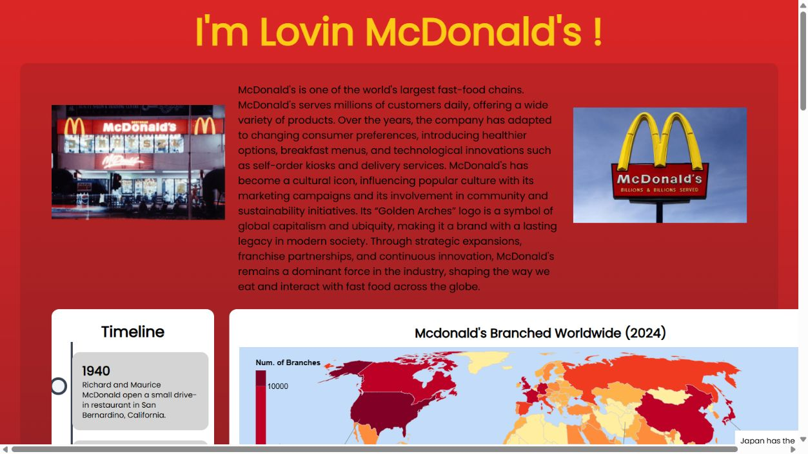

# McDonald's Data Visualization Dashboard

**[Explore the live dashboard](https://tay1203.github.io/DV2/)**

An interactive web dashboard that explores McDonald's history, worldwide restaurant distribution, revenue trends, and Malaysian menu nutrition. It combines visual storytelling with a meal explorer that lets visitors see how their food choices change the displayed nutrient totals.

## Screenshot

*Screenshot of the live site's opening view. Open the demo to explore the revenue and nutrition sections below it.*

## Features

- **History and geography:** a scrollable timeline alongside a world choropleth map of restaurant counts. Selected milestones place event markers on the map.
- **Revenue exploration:** stacked areas for company-operated sales and franchised revenue, a total-revenue line, and hover details.
- **Interactive menu tree:** browse food categories and click individual items to update the meal selection.
- **Build a meal:** choose a main, side, and drink; see food images and combined calories, carbohydrate, protein, fat, sugar, and salt values.
- **Nutrition visuals:** nutrient bars, calorie totals, sugar/salt reference-intake indicators, and a button to cycle through explanatory tips.

## Tech stack

- **HTML, CSS, and vanilla JavaScript** for the page and interactions.
- **Vega 5, Vega-Lite 5, Vega-Embed, and Vega Tooltip** for declarative charts, geographic layers, tooltips, and linked selections.
- **Tailwind CSS 3** for layout and styling, with npm used for the CSS build workflow.
- **CSV, JSON, and TopoJSON** for tabular data, menu hierarchies, and map geometry.

## What I learned

- Choosing different visual encodings for geographic distribution, time-series trends, hierarchical menus, and nutrient comparisons.
- Joining country data to geographic boundaries and using projections, colour scales, labels, and tooltips to make maps readable.
- Coordinating JavaScript controls with Vega signals and datasets so charts respond to the same selection.
- Aggregating nutrients across multiple selected foods and switching between single-item and combined-meal views.
- Combining narrative text, annotations, visual hierarchy, and interactive exploration in a static website.
- Working with external data dependencies and recognizing the importance of source attribution and clearly stated reference values.

## Data and project notes

The project was completed in October 2024. The map is labelled with 2024 data, and the revenue chart covers 2009–2023; these are project datasets, not a live data feed. Menu nutrition is attributed in the dashboard to McDonald's Malaysia. The nutrition indicators use the reference values encoded in the project.
The original [design document](FDS.pdf) is also included.
